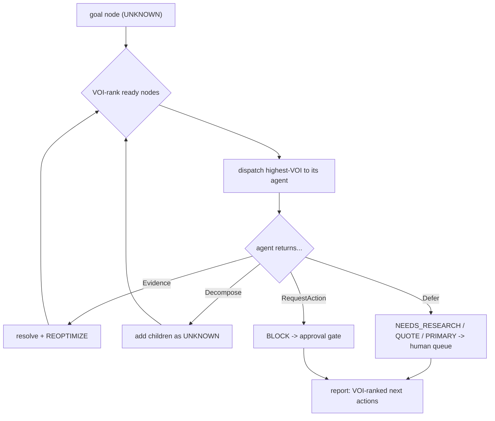

# The Agentic OS

The repo was a **sophisticated decision engine + one narrow scraper**. This layer makes it an
**autonomous system**: a Governor that decomposes a goal into a graph of questions, dispatches agents
to resolve them, and — critically — **knows what it cannot resolve** and hands those to a human,
ranked by value. It orchestrates the engines already built (event_optimizer, value_matrix,
node_scraper, voi, grounding) rather than replacing them.

## The core loop

```
UNKNOWN  ->  VOI-rank  ->  AgentTask  ->  run  ->  { Evidence | Decompose | Defer | RequestAction }
         ->  NodeUpdate  ->  (recurse / rollup)  ->  Reoptimize
```

Files: [`agent_os.py`](../../engine/agent_os.py) (graph, queue, permissions, logs),
[`agents.py`](../../engine/agents.py) (the registry + 15 agents),
[`governor.py`](../../engine/governor.py) (the loop + the Cornell pipeline),
[`schema/013_agentic.sql`](../../schema/013_agentic.sql), [`test_agent_os.py`](../../engine/test_agent_os.py) (17 checks).

## The node graph

Every question is a `Node` with a `status` that is **never fabricated**:

| status | meaning |
|---|---|
| `UNKNOWN` | not yet resolved |
| `RESOLVING` | an agent is working it |
| `RESOLVED` | has a **sourced** value |
| `DECOMPOSED` | replaced by children; rolls up when they finish |
| `NEEDS_RESEARCH` | needs live web/LLM cognition (a hook, not yet run) |
| `QUOTE` | real but behind "contact us" — a human email |
| `PRIMARY` | exists nowhere online — only a human commitment (a sponsor/buyer "yes") |
| `BLOCKED` | awaiting an approval gate |

Nodes carry `deps` (must resolve first) and `voi` (priority). The Governor only dispatches a node
whose deps are all resolved, and always picks the **highest-VOI** ready node first.

## What an agent returns

`run(node, graph, ctx)` returns exactly one of:

- **`Evidence(value, provenance)`** — resolves the node with a sourced value.
- **`Decompose([children])`** — recursive decomposition (sponsor universe → per-industry → per-firm → buyer).
- **`Defer(status, reason)`** — honestly marks `NEEDS_RESEARCH` / `QUOTE` / `PRIMARY` instead of guessing.
- **`RequestAction(description, payload)`** — an external action (email/spend). The node **BLOCKS** for
  human approval; the framework **never auto-executes** it.

## Permissions

Two levels. `AUTONOMOUS_READ` agents (research, computation) run with no approval. `NEEDS_APPROVAL`
agents (the `outreach` agent that would email a sponsor) can only **propose** — the action lands in the
approval queue and stays a human step even after approval. This is the safety boundary for a system
that could otherwise send email or spend money on its own.

## Append-only logs

Every run, decision, and approval is appended, never mutated (the tri-temporal spirit of `capture.py`).
`schema/013` persists `agent_run`, `decision_log`, `approval_gate`, and the `node` / `node_edge` graph.

## The Governor at work



## Honest boundary

The framework is fully real and tested. The **cognition agents** (economic-battle, topic-synthesis,
company-research) currently `Defer(NEEDS_RESEARCH)` — they expose a hook where a live web/LLM research
step plugs in, and they **seed** from repo evidence (top-prospects, cornell-audience-map) rather than
fabricate. See [agents.md](agents.md) for which agents are autonomous now versus hook-backed.
