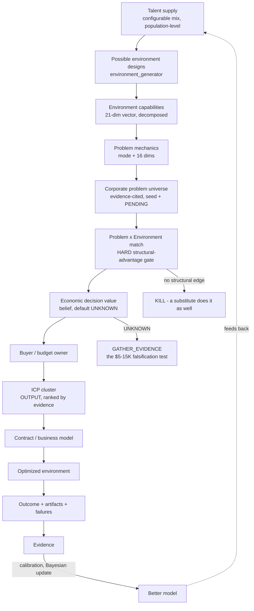
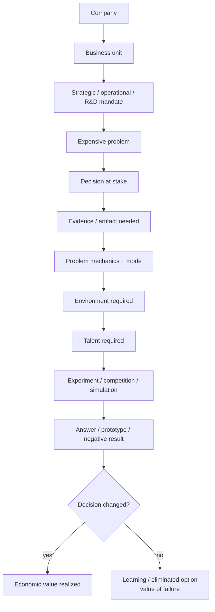
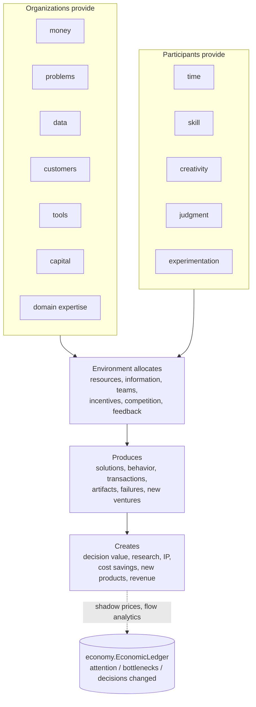
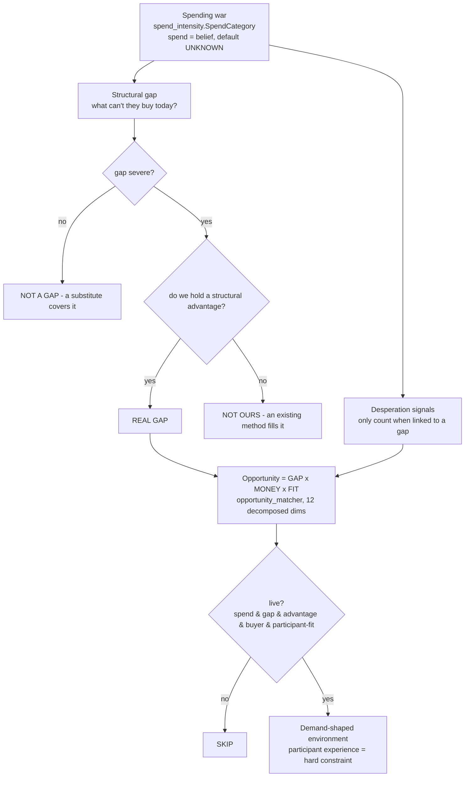

# Discovery Flowcharts

Mermaid diagrams for the reset. These describe the machine in
[discovery-engine.md](discovery-engine.md); they are architecture, not claims about any buyer.

---

## 1. Master discovery loop

## 2. Corporate problem flow

## 3. The temporary economy

## 4. The arms-race overlay (spend × gap × fit)

