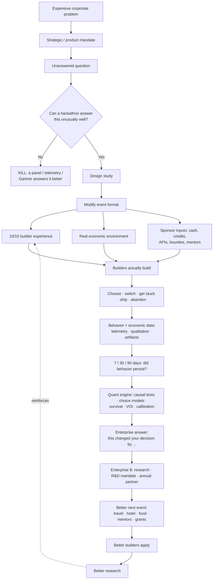
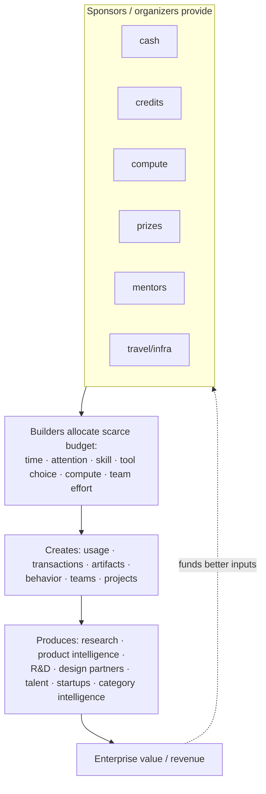
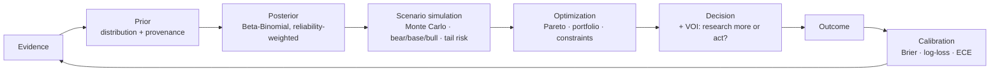

# Event System Flowcharts

Four diagrams that let a technical investor understand the company at a glance. Mermaid renders on
GitHub and in artifacts natively.

## A. Master system flow — problem → event → evidence → revenue → better event

The kill gate is explicit: if a hackathon holds no advantage over a panel/telemetry/Gartner, the
question dies ([research-modules.md](research-modules.md) HackathonAdvantage).



## B. Participant experience flow — every stage a lever, a capture point, a risk

```mermaid
flowchart LR
  A[Application] --> AC[Acceptance] --> TR[Travel<br/>funded] --> HO[Hotel] --> AR[Arrival]
  AR --> TF[Team formation] --> BU[Build] --> HE[Help sought] --> FS[Food / social]
  FS --> DE[Demo / pitch] --> FU[7/30/90 follow-up] --> AL[Alumni network]
  classDef cap fill:#e8f4ff,stroke:#4a90d9;
  classDef exp fill:#eaffea,stroke:#4caf50;
  class A,HE,BU,DE,FU cap
  class TR,HO,FS,AL exp
  HE -.capture: friction, in the moment they wanted help.-> BU
  DE -.capture: the pitch IS the exit interview.-> FU
  BU -.capture: artifacts + dependency manifest.-> DE
```


*Blue = capture opportunity (organic, disclosed); green = experience lever. Each stage also carries a
trust risk — over-prompting, perceived surveillance — governed by the research-minutes budget.*

## C. Event economy flow — the compressed micro-economy



## D. Quant decision loop — how beliefs become decisions and back



## The loop to obsess over

Diagram A's dotted return edge is the whole company:

```
research revenue → funds a better builder experience → attracts a better cohort
→ produces better research → commands higher enterprise WTP → funds a better experience → ↺
```

Which links are **evidenced** vs **hypotheses** (be honest): "better experience → better cohort" is
LIKELY (selective events draw talent — HackMIT's 5% admit rate). "Better research → higher WTP" is a
HYPOTHESIS (the `wtp_research_elasticity` assumption in [quant-assumptions.md](quant-assumptions.md))
— it is the single most important link to validate, and it is UNKNOWN until a paid pilot renews at a
higher price.
