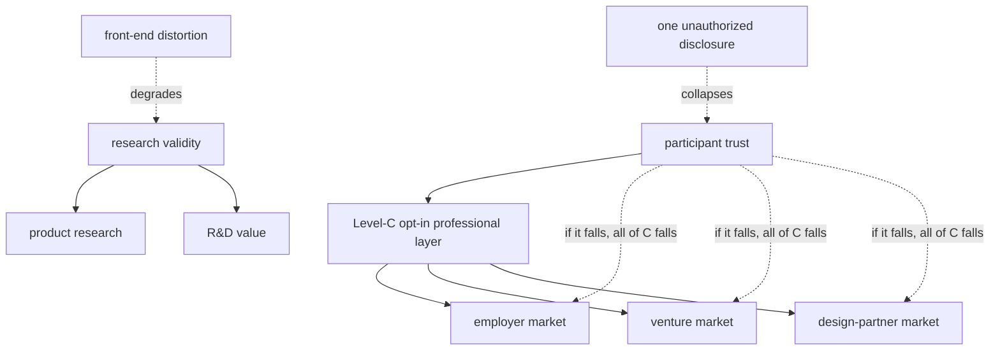

# Flywheels and systemic risk

`schema/011` `value_loop`. Across repeated events, some structures **compound** value and some create
**single points of failure** that could take down several sides at once. Naming them is how we invest
in the compounding loops and defend the fragile joints.

## Flywheels (value_loop.kind = FLYWHEEL)

1. **Evidence → reputation → better builders → richer evidence.** Better participants produce more
   valuable artifacts, which makes the event more attractive to the next cohort of builders and to
   demand-side buyers. Sides involved: participants, organizers, cornell, all demand sides.
2. **Longitudinal follow-up → continuation evidence → venture/employer value → participant
   opportunity.** The 90-day follow-up (`follow_up_90d`) is cheap to run and is the only source of
   *continuation* evidence, which is disproportionately valuable to VCs and employers — and it
   creates real opportunities for participants, reinforcing loop 1.
3. **Account deepening.** One company enters as a sponsor, sees real product usage
   (`brokered_key_use`), and expands into research + recruiting + design-partner roles — total
   account value compounds while budgets stay separate (`account_role`).
4. **Research asset reuse.** Aggregate artifacts (mentor logs, exit interviews) are reusable across
   multiple buyers at ~zero marginal participant burden — the closest thing to a pure positive-sum
   loop the system has.

## Systemic risks (value_loop.kind = SYSTEMIC_RISK, with a single point of failure)

| Risk | Single point of failure | Blast radius |
|---|---|---|
| **Trust breach** | one unauthorized individual disclosure | **every opt-in market at once** — employers, vcs, design_partners, and participant trust. The whole Level-C layer is downstream of participant trust. |
| **Front-end distortion** | a sponsored mechanic corrupting the open build track | research validity (product_clients, rd_clients) **and** participant experience simultaneously |
| **Over-burden** | too many research mechanics without mentor offset | participant floor breach → cohort quality drops → loop 1 reverses |
| **Legal (securities/employment)** | taking an investment success fee before counsel | organizer + the entire venture market (`MONETIZATION` FORBIDDEN_UNTIL_COUNSEL) |
| **Double-count / overclaim revenue** | counting one economic event under two budgets | credibility with every paying side; `dedup_revenue` + Shapley are the defense |

The structural point: **participant trust is the single upstream dependency of the entire demand
side.** Every opt-in market, every individual-grain reuse, every mutual intro sits below it. That is
*why* the participant floors are hard constraints and not weights — a floor breach isn't a worse
score, it's a threat to the whole graph.

