# Mechanism design: floors first, then Pareto, then Nash

`engine/mechanism_design.py`. Given the value/cost matrices, this layer picks the mechanic set that
maximizes cross-side value **subject to hard participant-experience floors that revenue can never
override.** Participant experience is a **hard constraint, not a soft weight.**

## 1. Hard participant floors — the top of the lexicographic order

`participant_floor_ok(mechanics) → (ok, violations)`. A design must satisfy **all** of these to be
*feasible*:

- **build_freedom** — must include `open_build_track` (an unconstrained surface to build on).
- **mentor_access** — must include `mentor_request`.
- **research_burden ceiling** — not ≥3 burdensome research mechanics (`exit_interview`,
  `checkpoint`, `follow_up_30_90`) without an offsetting `mentor_request`.
- **sponsor_pressure** — no `sponsored_bounty_track` unless an `open_build_track` counterweight is
  also present.

A floor violation makes the design **infeasible regardless of its revenue**:

```
nash_welfare({sponsor_keynote, sponsored_bounty_track, workshop})  →  -inf
```

even though that set is near-optimal for sponsors. This is the single most important invariant in
the system, and `test_multi_sided.py` asserts it directly.

## 2. Pareto frontier over stakeholder utility VECTORS

`pareto_frontier(designs)` ranks designs by **dominance over the stakeholder utility vector**, not
by a summed score. Design A dominates B iff A is ≥ B for every side and > for at least one. The
non-dominated set is the frontier — the honest menu of trade-offs, with no side silently sacrificed.

`stakeholder_utility(mechanics)` produces the per-side scalar used *only* for this comparison; the
decomposed cells stay visible in `value_matrix.U`.

## 3. Nash welfare — a tie-breaker only, never the objective

`nash_welfare(mechanics, floors) = Σ_s log(U_s − floor_s)`. The log makes it reward **balance**: a
design that captures almost all value for one side scores poorly because another side's `log` term
collapses. It returns **−∞** if any side is at/below its floor. It is explicitly a **secondary
tie-breaker among floor-respecting, Pareto-frontier designs** — not the canonical score. We never
"maximize Nash welfare" in place of respecting the frontier.

```mermaid
flowchart TD
  D[candidate design] --> F{participant floors ok?}
  F -- no --> X[INFEASIBLE — revenue cannot override]
  F -- yes --> G{frontend-distortion gate ok?}
  G -- no --> X
  G -- yes --> P{on Pareto frontier of\nstakeholder utility vectors?}
  P -- no --> DOM[dominated — a strictly better design exists]
  P -- yes --> N[rank remaining by Nash welfare\nΣ log&#40;U_s − floor_s&#41; — TIE-BREAK ONLY]
  N --> SEL[selected design]
```



## 4. Attention shadow price — value per participant-minute

`value_per_participant_minute(j)` = positive cross-side value ÷ participant-minutes consumed.
Participant attention is the scarcest resource; this is its shadow price. Verified ranking:

- `mentor_request` → **10.0** (LOW minute cost, high multi-side value)
- `sponsor_keynote` → **1.0**

i.e. a mentor interaction is ~10× more valuable per participant-minute than a sponsor keynote. Any
design that spends the participant-minute budget on keynotes over mentoring is destroying value.

## 5. The frontend-distortion gate

`frontend_distortion_gate(mechanics) → (ok, problems)` rejects designs where a commercial mechanic
distorts the participant frontstage or research validity beyond bound. It flags any `HIGH`
frontend-distortion mechanic and, specifically, the `sponsored_bounty_track + open_build_track`
contamination (their synergy is `NEG`). This is the net-new gate that keeps the front-facing product
from being corrupted by the value engine underneath — the "front-end distortion" risk named in the
brief.

## 6. Packing — optimize the whole portfolio

`optimize_event_portfolio(candidate_mechanics, attention_capacity=8)` searches exactly over subsets
(mechanic counts are small) for the set that maximizes total cross-side value **subject to**: the
attention-capacity cap, the participant floors, and the distortion gate. It returns the selected set
and its total value. `test_multi_sided.py` verifies the packed set never exceeds the attention cap
and never violates the floor.

## 7. Maximize for one side — without harming participants

`maximize_for(stakeholder)` ranks the mechanics most valuable to a given side, tagging each with
`harms_participants` and `distorts_frontstage`, and marks a mechanic **inadmissible** if it both
harms participants and distorts the frontstage. This is how we answer "what should we do to maximize
value for employers / VCs / sponsors?" **without** the answer ever being "at the participants'
expense."

## The lexicographic objective, stated plainly

1. **Feasibility** (participant floors + distortion gate) — inviolable.
2. **Pareto efficiency** over the stakeholder utility vector — no side needlessly sacrificed.
3. **Nash welfare** — balance, as a tie-break only.

Revenue enters at level 2 (it is one side's utility among many), **never** at level 1.
