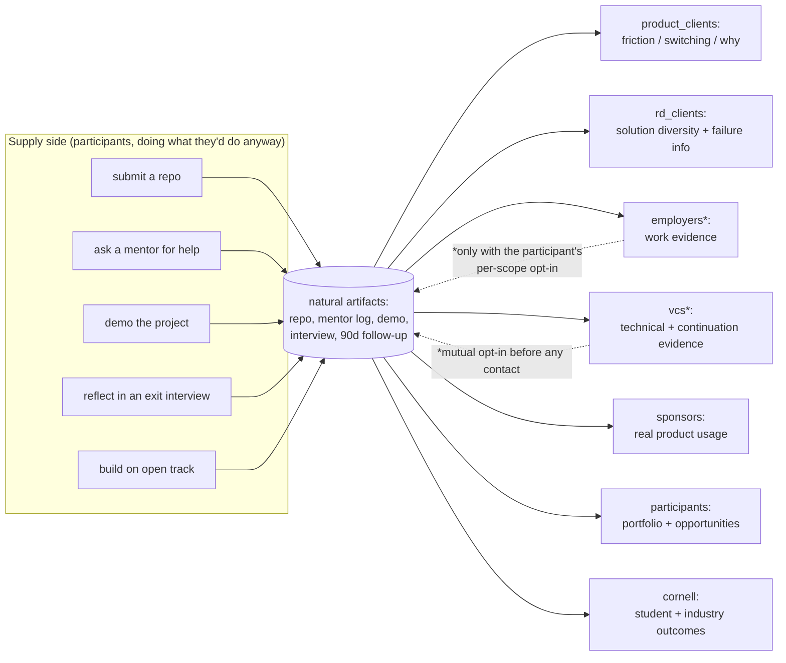

# The event is a multi-sided market, not a hackathon with sponsors

> **The one question this whole layer answers:**
> How do we design **one** event so that the **same natural activities** create **maximum value
> across many different stakeholders** *without those stakeholders destroying each other's value?*

The front-facing product is an elite student hackathon. Underneath it is a multi-sided market. The
**supply side** (participants doing what they'd do anyway — build, ask for help, demo, reflect)
produces artifacts that **fan out** to many **demand sides** who value them for different reasons and
can be charged differently. The design job is *mechanism design*: choose the set of event mechanics
that pushes the whole system toward the Pareto frontier of stakeholder utilities — subject to **hard
participant-experience floors that revenue can never buy through.**

This is the opposite of "extract maximum value from every side." The standard (Part LXXX) is:

> discover **positive-sum structures** where the same activity creates value for many sides with
> **little or no additional participant burden.**

## The sides

`engine/value_matrix.py::STAKEHOLDERS` — 14 sides, each with a **decomposed utility vector**
(`UTILITY_DIMS`), never a single score:

| Side | Supply/Demand | Pays? | Cares about (sample of its utility vector) |
|---|---|---|---|
| participants | **supply** | no† | fun, learning, autonomy, building, mentor_access, career/startup/funding opportunity, trust, **−burden** |
| teams | supply | no | build_progress, cohesion, recognition, continuation |
| employers | demand | yes | relevant_talent, work_evidence, capability_evidence, search_efficiency |
| vcs | demand | yes | relevant_dealflow, technical_evidence, team_evidence, founder_optin |
| product_clients | demand | **yes** | choice_evidence, friction_evidence, switching_evidence, retention, qualitative_why |
| rd_clients | demand | yes | solution_diversity, prototype_quality, **failure_information**, search_speed |
| sponsors | demand | **yes** | brand_exposure, useful_engagement, product_usage, developer_relationship |
| mentors | both | no | impact, recruiting_signal, recognition, learning |
| judges | demand | no | (event integrity) |
| cornell | ecosystem | no | student_outcome, entrepreneurship, industry_relationship, reputation |
| organizers | us | — | revenue, contribution_margin, repeatability, research_assets, renewal |
| accelerators / design_partners / followon_customers | demand | maybe | discovered sides — value UNKNOWN until Event 1 |

† **The participant supply side is never charged to be discovered.** That is a hard rule
(`schema/011` `cross_subsidy_flow.charges_supply_for_discovery`), not a preference.

## Utility is a vector, and it stays a vector

We never collapse a stakeholder's utility into one number and then sum across stakeholders — that is
exactly how a design that quietly guts the participant experience can look "optimal." The decomposed
cells live in `value_matrix.U`. A single scalar per side exists **only** inside
`mechanism_design.stakeholder_utility()` and **only** to compare designs by Pareto dominance. See
[mechanism-design.md](mechanism-design.md).

## Supply → demand fan-out

The starred edges (employers, vcs) light up **only** with the participant's explicit per-scope
opt-in, and no contact is released without **mutual** opt-in — enforced in
`engine/opportunity_market.py::fan_out` and `engine/mutual_intro.py::release_contact` (reused, not
rebuilt here). Everything else flows at **aggregate grain**, which needs no individual consent.

## Why they don't destroy each other's value

Three mechanisms, each with its own doc:

1. **Hard floors** — a mechanic set that starves the participant experience is *infeasible*, so no
   amount of sponsor revenue can select it. → [mechanism-design.md](mechanism-design.md)
2. **The conflict matrix + frontend-distortion gate** — a sponsored bounty track that contaminates
   the open, research-valid build track is rejected outright. → [mechanic-value-matrix.md](mechanic-value-matrix.md)
3. **Consent-gated multi-use + no double-counting** — the same artifact serves many sides, but
   individual reuse needs opt-in and one contract is Shapley-split once. → [multi-use-assets.md](multi-use-assets.md)

## What is honestly still UNKNOWN

Per STATE.md discipline (**Evidence ≠ Claim ≠ Hypothesis ≠ Decision**), most cross-side value cells
in `value_matrix.U` carry tag **H** (hypothesis) or **U** (unknown), and **observed willingness-to-pay
is UNKNOWN** until Event 1 measures it. This layer is the *structure* for discovering positive-sum
designs; it is not a claim that the money is already there. The quant layer's honest base case is
still negative expected contribution (`docs/quant-engine.md`); this layer does not overturn that, it
tells you *which designs are even admissible* to test.
