# Multi-use assets, consent, and no double-counting

`engine/multiuse_assets.py`. One naturally-produced artifact serves **many** downstream sides. This
is where the positive-sum value actually comes from — but it is also where a naive system either (a)
leaks individual data without consent, or (b) counts the same dollar several times. Both are blocked
here. Reuses `compliance` (disclosure rules) and `opportunity_market.dedup_revenue`.

## One asset → many uses

`ASSET_USES` maps each asset to `(stakeholder, use, consent_scope, grain)`:

| asset | reused by (use · scope · grain) |
|---|---|
| **project_repo** | judges(judging·event·agg) · product_clients(tool-use·AGGREGATE·agg) · rd_clients(artifact·rd_license·agg) · **employers(work-evidence·RECRUITING·individual)** · **vcs(diligence·VC·individual)** · participants(portfolio·self·individual) · organizers(benchmark·AGGREGATE·agg) |
| **mentor_log** | product_clients(friction·AGGREGATE·agg) · organizers(support-model·internal·agg) |
| **exit_interview** | product_clients(qualitative-why·QUALITATIVE·agg) · organizers(insight·internal·agg) |
| **demo** | judges · **vcs(discovery·VC·individual)** · **employers(capability·RECRUITING·individual)** · organizers(content·PUBLIC_MEDIA·agg) |
| **follow_up_90d** | product_clients(retention·AGGREGATE·agg) · **vcs(continuation·VC·individual)** |

`reuse_map(asset)` returns this list. The **bold individual-grain** uses are the only ones that
touch a person; everything else is aggregate.

## Rights: aggregate is free, individual needs the exact opt-in

`rights_ok(asset, stakeholder, granted_scopes)`:

- **aggregate grain** → always permitted (no individual is exposed).
- **individual grain** → permitted **only if the exact opt-in scope is in `granted_scopes`.**
  Absence of an opt-in defaults to **not visible** — the compliance rule.

Verified:

```
rights_ok("project_repo", "employers", set())                          → False   # no opt-in
rights_ok("project_repo", "employers", {"RECRUITING_DISCOVERABILITY"}) → True    # opt-in granted
rights_ok("project_repo", "product_clients", set())                    → True    # aggregate
```

Contact release on top of this still requires **mutual** opt-in via `mutual_intro.release_contact`
(reused) — an opt-in to be *discoverable* is not consent to *release contact*.

## No double-counting: one contract, Shapley-split once

A single project can lead to many transactions, and a single contract can be produced by several
assets together. `attribute_revenue(contract_value, components_present, all_components)` splits the
**one** contract across the components by **Shapley value**, using a transparent completeness value
function (`v(subset) = contract × fraction_of_components_present`). Properties:

- The shares **sum to the present-component portion of the contract exactly once** — it splits the
  actual contract, it does not invent value.
- Components not present in the deal get **0**.

Verified: `attribute_revenue(90000, {artifact, interview}, {artifact, interview, mentor_log,
followup})` → total **$45,000** (exactly 2 of 4 components present), and `mentor_log → $0`.

At the ledger level, `opportunity_market.dedup_revenue(economic_events)` sums each economic id
**once**, so the same value surfacing through multiple markets is never counted twice.

## Who pays, and who is cross-subsidized

`schema/011` `cross_subsidy_flow` records **who is charged**, **who is subsidized**, and the
**pricing model** for each flow, so the business model is explicit:

- **Sponsors / product_clients / rd_clients / employers / vcs** are the **paying demand sides**
  (pricing models: SPONSORSHIP, ACCESS_SUBSCRIPTION, DIRECTED_RESEARCH_WALLET, DESIGN_PARTNER_FEE).
- **Participants are subsidized, never charged for discovery** — `charges_supply_for_discovery` is a
  hard `false`. Flying builders out and feeding them is a cost paid **by** the demand side, not by
  the builders.
- The **monetization_kind** on each flow maps to `opportunity_market.MONETIZATION`, which is
  legality-gated: investment success fees are `FORBIDDEN_UNTIL_COUNSEL`
  (`assert_monetization_allowed` raises), placement/paid-project facilitation is `NEEDS_LEGAL`.

Price **each side differently** for the **same** underlying artifact: a product client pays for
aggregate friction evidence; an employer pays for access to opt-in work-evidence; a sponsor pays for
real product usage. None of them are buying the same thing, so charging each differently is
positive-sum, not arbitrage.

## One company is many buyers: the account value graph

`schema/011` `account` + `account_role`. A single company (say, a large AI lab) can simultaneously be
a **sponsor**, a **research buyer**, an **employer**, and a **design partner**. We track the total
relationship value across those roles **but keep the budgets separate** (`account_role.budget_line`),
so spend from the recruiting budget is never counted as research revenue and vice-versa. This is how
you grow an account's total value honestly without double-counting it.

```mermaid
flowchart LR
  REPO[(project_repo)] --> AGG[aggregate friction /\ntool-use evidence]
  REPO --> IND[individual work-evidence]
  AGG --> PC[product_clients &#40;pays: research&#41;]
  AGG --> RD[rd_clients &#40;pays: R&D license&#41;]
  IND -. "opt-in RECRUITING" .-> EMP[employers &#40;pays: access&#41;]
  IND -. "opt-in VC + mutual intro" .-> VC[vcs]
  PC --> ACC[[same company =\none account, many\nseparate budget lines]]
  EMP --> ACC
  ACC --> ATTR[contract → Shapley split\nsums once, no double-count]
```


