# Synthesis — the multi-sided design, answered

The binding question again:

> **How do we design one event so the same natural activities create maximum value across many
> different stakeholders without those stakeholders destroying each other's value?**

The answer is a **lexicographic mechanism-design problem** on top of the existing architecture:
choose the mechanic subset that is (1) feasible under hard participant floors + the distortion gate,
then (2) Pareto-efficient over the stakeholder utility vector, then (3) Nash-balanced as a tie-break.
Positive-sum value comes from **multi-use artifacts** consumed by many sides at aggregate grain (free
of individual burden), with individual reuse strictly consent-gated and every contract Shapley-split
once.

This layer reuses — does **not** replace — `opportunity_market`, `mutual_intro`, `burden_budget`,
`compliance`, `org_graph`, and the talent/venture markets. Net-new files:
[`value_matrix.py`](../../engine/value_matrix.py), [`mechanism_design.py`](../../engine/mechanism_design.py),
[`multiuse_assets.py`](../../engine/multiuse_assets.py), [`test_multi_sided.py`](../../engine/test_multi_sided.py),
[`schema/011_multi_sided.sql`](../../schema/011_multi_sided.sql).

## Master queries

| Query | Function | Answers |
|---|---|---|
| **analyze_mechanic(j)** | `value_matrix.analyze_mechanic` | who does mechanic *j* create/destroy value for, at what burden, with what synergies and unknowns |
| **optimize_event_portfolio(cands, cap)** | `mechanism_design.optimize_event_portfolio` | the best *feasible* mechanic set under the attention cap + floors + distortion gate |
| **maximize_for(side)** | `mechanism_design.maximize_for` | how to create the most value for one side *without* harming participants |
| **route_opportunities** | `opportunity_market.fan_out` + `mutual_intro` (reused) | which sides a participant's activity can serve, gated by per-scope + mutual opt-in |
| **value_per_participant_minute(j)** | `mechanism_design.value_per_participant_minute` | the attention shadow price — is this mechanic worth the scarcest resource |

## The ~22 final questions, answered

**1. Is this one event or many products?** One event; many value surfaces fed by the same artifacts.
The hackathon is the supply-side generator; the products are the demand-side reuses.

**2. Who are the sides?** 14 (`STAKEHOLDERS`). Supply: participants, teams (+mentors). Paying demand:
product_clients, rd_clients, sponsors, employers, vcs (+discovered: design_partners, accelerators,
followon_customers). Ecosystem: cornell. Us: organizers.

**3. What does each side actually value?** A **vector**, not a score — `UTILITY_DIMS`. Never summed
across dimensions or across sides except the illustrative scalar used only for Pareto comparison.

**4. Which activities are naturally multi-use?** Highest cross-side fan-out: **demo (8 sides)**,
repo_submission, mentor_request, brokered_key_use. These are where positive-sum value lives.

**5. Which activities destroy other sides' value?** sponsor_keynote (−participants),
sponsored_bounty_track (−product_clients research validity), exit_interview/checkpoint (−participant
burden). Exactly the high-sponsor-value mechanics.

**6. How do we stop the destruction?** Hard floors (`participant_floor_ok`) + conflict matrix +
`frontend_distortion_gate`. Floor-violating designs are **infeasible**, `nash_welfare → −inf`.

**7. Can revenue ever override the participant experience?** **No.** Floors are lexicographically
above revenue; revenue is one side's utility at level 2, floors are level 1. Asserted in tests.

**8. How do we choose among good designs?** Pareto frontier over the utility vector; Nash welfare
(Σ log(U_s − floor_s)) as a **tie-break only**, which rewards balance and punishes one-side capture.

**9. What is the scarcest resource?** Participant attention. Priced by
`value_per_participant_minute` — mentor_request **10.0** vs sponsor_keynote **1.0**.

**10. Who pays?** The demand sides (sponsors, product/rd clients, employers, vcs). `cross_subsidy_flow`.

**11. Who is subsidized?** Participants — flown out, housed, fed by demand-side money. **Never
charged to be discovered** (`charges_supply_for_discovery = false`).

**12. Do we price each side the same?** No — each buys a *different* thing from the *same* artifact
(aggregate friction vs opt-in work-evidence vs real product usage), so differential pricing is
positive-sum, not arbitrage.

**13. What about one company that is many buyers?** `account` + `account_role` track total
relationship value with **separate budget lines**; growth is real, not double-counted.

**14. How do we avoid double-counting revenue?** Shapley split of each contract
(`attribute_revenue`, sums once) + ledger `dedup_revenue` (each economic id once). Verified $45K/$90K.

**15. How is individual data protected?** Aggregate grain is free; individual reuse needs the exact
per-scope opt-in (`rights_ok`); contact needs **mutual** opt-in (`mutual_intro.release_contact`).

**16. Any person scores?** None, ever. `compliance.assert_not_a_person_score` raises on
hireability/founder_quality/etc.; no sensitive attribute is collected (`assert_no_sensitive`).

**17. What are the flywheels?** Evidence→reputation→better builders→richer evidence;
follow-up→continuation evidence→opportunity; account deepening; aggregate-asset reuse.
See [flywheels-and-risk.md](flywheels-and-risk.md).

**18. What is the biggest systemic risk?** A single unauthorized disclosure — participant trust is
the upstream dependency of the *entire* opt-in demand side; its failure collapses all of Level C.

**19. What legal lines are hard?** Investment success fees `FORBIDDEN_UNTIL_COUNSEL`; placement/paid
facilitation `NEEDS_LEGAL`. `assert_monetization_allowed` enforces the forbidden line in code.

**20. Is the money proven?** **No.** Observed WTP is **UNKNOWN** (every `analyze_mechanic` says so);
most value cells are H/U; the quant base case is still ~−$109K expected contribution. This layer
tells you which designs are *admissible to test*, not that they pay.

**21. What would change the answer?** VOI says ~5–10 buyer conversations (`docs/quant-engine.md`)
before committing — cheapest way to move WTP cells from H/U to O.

**22. What is the design standard?** Not maximum extraction. **Positive-sum: the same activity
creating value for many sides with little or no added participant burden** (Part LXXX). Encoded as
the lexicographic objective with floors on top.

## Guardrails (Part LXXIX) — all enforced in `test_multi_sided.py`, 23/23 passing

1. Revenue-max design missing open-build **violates** the participant floor.
2. A floor-violating design is **infeasible** (`nash = −inf`) regardless of sponsor value.
3. Contact **not** released without mutual opt-in; released **only** after it.
4. Person scores (candidate/founder/employability/hireability) **refused**.
5. Individual asset reuse needs the exact opt-in scope; aggregate is free.
6. One contract Shapley-splits, summing **once**; ledger dedups by id.
7. Sponsored bounty contaminating open-build **rejected** by the distortion gate.
8. Packed portfolio respects the **attention-capacity cap** and the participant floor.
9. mentor_request ≫ sponsor_keynote in value **per participant-minute**.
10. High-fan-out multi-use mechanic (demo ≥ 6 sides) identified; sponsor_keynote flagged as
    harming participants.
11. **Observed WTP stays UNKNOWN**; protected attributes refused in any schema; cost kept separate
    from value.

## Where this sits

```mermaid
flowchart TD
  EV[Event 1 &#40;the front-facing hackathon&#41;] --> ART[natural artifacts]
  ART --> VM[value_matrix: U / C / fan-out / synergy]
  VM --> MD[mechanism_design: floors → Pareto → Nash]
  MD --> DESIGN[admissible event design]
  ART --> MU[multiuse_assets: consent-gated reuse + Shapley]
  MU --> MKT[existing markets: opportunity / mutual_intro /\ntalent / venture — REUSED, not rebuilt]
  DESIGN --> EV
  MKT --> REV[revenue, per-side priced, deduped]
  REV -. "one side's utility at level 2 — never overrides floors at level 1" .-> MD
```

The event feeds the matrices; the matrices constrain the event; the artifacts feed the markets; the
markets' revenue is just one side's utility — and it never buys through the participant floor.
