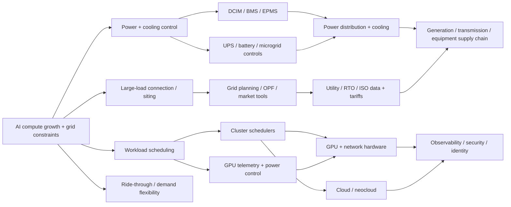

# GridCompute — Recursive Product Economy

## Economic chain

## Layer 0 — underlying economic problem

AI data centers are now a rapidly growing and unusually dynamic load. The event is not justified by “AI is big.” It is justified by concrete operational and regulatory failures:

- FERC is forcing regional operators to address large-load integration and “speed-to-power.”
- DOE says transmission need is rising with data centers and industrial loads.
- PJM reported a July 2026 event where nearly 4,000 MW of computational load disconnected unexpectedly.
- IEA projects global data-center electricity consumption roughly doubling to ~945 TWh by 2030.

## Layer 1 — decisions / workflows teams can influence in 36–48h

1. **Workload placement:** which jobs run now/later, where, under what power cap.
2. **GPU power policy:** performance versus power envelope, cap profiles, throttling strategy.
3. **Cooling-aware scheduling:** shift work given thermal limits and facility overhead.
4. **Battery/microgrid dispatch:** buffer fast ramps, outages or grid constraints.
5. **Large-load ride-through:** controlled response to disturbances instead of uncontrolled synchronized disconnects.
6. **Interconnection / siting policy:** trade time-to-power, generation/storage, curtailment and cost.
7. **Market participation:** flexible-load bids or demand-response strategies where the simulator supports them.

## Layer 2 — enterprise/control products

Product categories that sit directly in these workflows:

- cluster orchestration / batch scheduling (Kubernetes-, Slurm-class systems);
- GPU management/telemetry (e.g. NVIDIA DCGM exposes power limits and workload power profiles);
- DCIM, BMS and EPMS;
- UPS, battery and microgrid controllers;
- grid power-flow / optimal-power-flow / planning tools;
- optimization solvers;
- observability and incident tooling.

Current primary product evidence:

- NVIDIA DCGM supports per-GPU/group power limits and workload power profiles: https://docs.nvidia.com/datacenter/dcgm/latest/reference/command-line-reference/dcgmi/dcgmi-config.html
- Schneider's 2026 AI-infrastructure controls design explicitly ties EPMS/BMS interoperability to AI cluster/workload management and measures AI-rack power profiles: https://www.se.com/us/en/download/document/CRD2DS/
- Microsoft GridFM targets fast AC optimal-power-flow evaluation as datacenter expansion increases grid volatility: https://www.microsoft.com/en-us/research/project/gridfm/

## Layer 3 — products behind the products

- Cloud/neocloud compute and capacity management.
- NVIDIA/AMD accelerators and server platforms.
- Ethernet/InfiniBand/network fabrics and switches.
- Power distribution, UPS, transformers, switchgear.
- Liquid cooling, coolant distribution units, chillers, facility controls.
- Storage/BESS and on-site generation.
- Grid data, load forecasts, interconnection rules and tariffs.
- Monitoring, observability, security and identity.

## Layer 4 — physical/economic substrate

- Generation and transmission capacity.
- Capacity/resource-adequacy markets.
- Utility interconnection queues and large-load agreements.
- Data-center campuses / colo real estate.
- Equipment manufacturing and supply chains.
- Capital providers/infra investors and engineering services.

## Recursion stopping rule applied

We stop before generic adjacency such as “a cooling vendor uses ERP” because the event cannot materially influence that ERP buying decision. We continue through power/cooling/grid/compute because participant policies, integrations or benchmark outcomes can plausibly affect product design, integration, procurement or R&D decisions at those nodes.

## Anchor commercial product

**Power-Constrained AI Systems Benchmark + Parallel R&D Tournament**

A buyer could rationally buy this without a logo or booth if the supplied simulator/scenarios are decision-relevant. Deliverables:

- benchmark harness and reproducible scenario pack;
- 30–50 independent solution attempts;
- Pareto frontier of throughput/reliability/cost/latency/power;
- failure-mode taxonomy and stress-test results;
- architecture/prototype portfolio;
- integration-friction notes where a vendor voluntarily supplies tooling;
- optional 4–8 week paid continuation with selected teams.

The buyer **cannot** rationally treat this as production validation unless the data/scenarios support that claim. The safe product is parallel R&D / benchmark evidence, not certification.
