# Time as a primary dimension — the temporal model

The engine used to think: **Person + Context + Action → Outcome.** That is a snapshot. The real object
is a **trajectory**:

```
State_t → Event_t → Decision_t → Intervention_t → State_{t+1} → Outcome_{t+k}
```

or, fully:

```
PriorState_t → Context_t → OpportunitySet_t → Trigger_t → ChoiceSet_t → Decision_t →
Action_t → Intervention_t → Artifact_t → ImmediateOutcome_t → NextState_{t+1} → DelayedOutcome_{t+k}
```

`engine/temporal_core.py::PRIMITIVE_CHAIN`. These three statements are completely different, and the
third is worth vastly more than the first:

1. *Team used Supabase.*
2. *Team used Supabase for the entire event.*
3. *Team considered Firebase, started with Supabase, hit an auth failure at hour 4, got mentor help at
   hour 4.5, stayed until submission, then migrated to Firebase 12 days later.*

This layer is how the system stores and reasons about **(3)**. It is not "add timestamps" — time
changes interpretation, prediction, causal reasoning, allocation, pricing, evidence validity, and
professional/venture evidence. Everything here is built **on** the existing tri-temporal capture
(`engine/capture.py`) — it is not a second architecture.

## The four clocks (never conflated)

`temporal_core.Clock`:

| Clock | Ticks | Example |
|---|---|---|
| **EVENT** | minutes/hours of Event 1 | minute 0 → hour 3 → hour 18 → submission |
| **PROJECT** | build lifecycle | idea → architecture → prototype → failure → pivot → demo |
| **LIFECYCLE** | person/team over time | pre-event → event → 7d → 30d → 90d → later |
| **MARKET** | the world around the event | product launch → pricing change → AI trend → recruiting cycle |

A `Stamp` carries its `Clock`, so hour-4 (EVENT) is never confused with day-30 (LIFECYCLE). Conflating
them is a category error the type system now rejects.

## Point-in-time truth (no future leakage)

The single most important invariant. `capture.py` already distinguishes three times on every
`EvidenceEvent`: `occurred_at` (when it happened) ≠ `observed_at` (when we recorded it) ≠
`available_at` (when it became queryable). A participant who tells us Sunday that they switched DBs
Friday makes an event that **occurred** Friday but was **available** Sunday.

`temporal_core.information_set(events, as_of)` returns exactly `{ e : available_at(e) ≤ as_of }` — the
only events a model or prediction made at `as_of` may use. `assert_no_future_leakage` raises if a
computation touches a not-yet-available event. This is what makes honest backtesting possible: a
prediction "as of Friday night" cannot cheat with Sunday's knowledge. `schema/012` stamps
`available_at` on every temporal row and `prediction_snapshot.information_cutoff` records it.

## Event sourcing

`temporal_core.derive_state(events, as_of, reducer, initial)` folds the **immutable** event log into
derived state — in `occurred_at` order, using only events available by `as_of`. Derived state is never
hand-edited; it is always reconstructable from the log. (`schema/012 temporal_state.derived_from`.)

## Duration metrics

`time_metrics(typed_events)` turns "a mentor helped" into measurements. The worked example — blocker
began 14:03, mentor requested 14:17, arrived 14:24, intervention ended 14:33, first success 14:47 —
yields **BlockedDuration = 44 min, MentorWait = 7 min, TimeToRecovery = 14 min** (verified in
`test_temporal.py`). Across 100 episodes this becomes *"which intervention resolves which blocker
fastest, at which project stage?"* — far beyond simple mentor counts. Missing anchors return **None**,
never a fabricated 0.

## The twelve engines and how they map to the spec

| Engine | Spec parts | What it does |
|---|---|---|
| `temporal_core.py` | I, II, VI, VIII | four clocks, information-set/no-leakage, event sourcing, durations |
| `context_envelope.py` | III, IV, V, XXXI, XXXII | ContextEnvelope, dynamic C_i(t), opportunity set O_i(t), no person score |
| `episode.py` | VII, VIII, LXXI | the Episode master object, reconstruction, thick description |
| `temporal_graph.py` | IX, X, XX, XXXIII–IV, LXXVI–VII | timestamped edges, window/trajectory queries, motif mining |
| `state_space.py` | XI, XII | team state transitions (only with enough data), hidden state |
| `survival.py` | XIII, XIV | Kaplan–Meier hazard, event intensity/bursts |
| `freshness.py` | XXIV, XXV, LIX | evidence freshness/decay by claim type |
| `temporal_voi.py` | XXVI–IX, LXII | VOI(E,t), decision deadlines, temporal product ladder |
| `optimal_stopping.py` | XVII, XVIII | continue vs pivot; R&D kill vs fund |
| `dynamic_allocation.py` | XXXIX, XL, XLII, XLIV, XLVI | minute ledgers, interruption cost, critical path, reallocation |
| `process_tracing.py` | LXX, LXXI, LXXVIII | mechanism reconstruction, counterfactual honesty |
| `trajectory.py` | XXX–I, XXXVI–VIII, LXXVII | trajectories, archetypes, domain templates, no IQ |

## The final standard (Part LXXXV)

The engine should no longer merely know **who did what**. It should reconstruct: *who* was trying to
achieve *what*, at *which time*, from *which starting state*, with *which opportunity set*, under
*which constraints*, after *which prior events*, among *which people/resources*, with *which
alternatives*, made *which decision*, received *which intervention*, produced *which artifact*, after
*how long*, with *what immediate result*, and *what happened 7/30/90 days later*.

> Time turns snapshots into trajectories. Context turns events into explanations. Together they turn
> hackathon telemetry into **process-level decision intelligence** — and the moat becomes less "we
> know 2,000 data points about a participant" and more "we can reconstruct high-value technical work,
> decisions, interventions, failures, recoveries, and outcomes as contextualized trajectories over
> time."

See [synthesis.md](synthesis.md) for the master queries (LXXV–LXXXI) answered.

```mermaid
flowchart LR
  LOG[(immutable evidence log\noccurred/observed/available)] --> IS[information_set&#40;as_of&#41;\nno future leakage]
  IS --> EPI[episode reconstruction]
  IS --> STATE[derive_state &#40;event sourcing&#41;]
  EPI --> DUR[duration metrics]
  EPI --> GRAPH[temporal graph\nwindow / trajectory / motif]
  STATE --> SS[state transitions]
  GRAPH --> TRACE[process tracing +\ncounterfactual honesty]
  DUR --> ALLOC[time allocation / critical path]
  EPI --> TRAJ[trajectories + archetypes]
  IS --> PRED[prediction_snapshot\ninformation_cutoff]
  PRED --> BT[backtest w/ strict\ntemporal splits]
```


