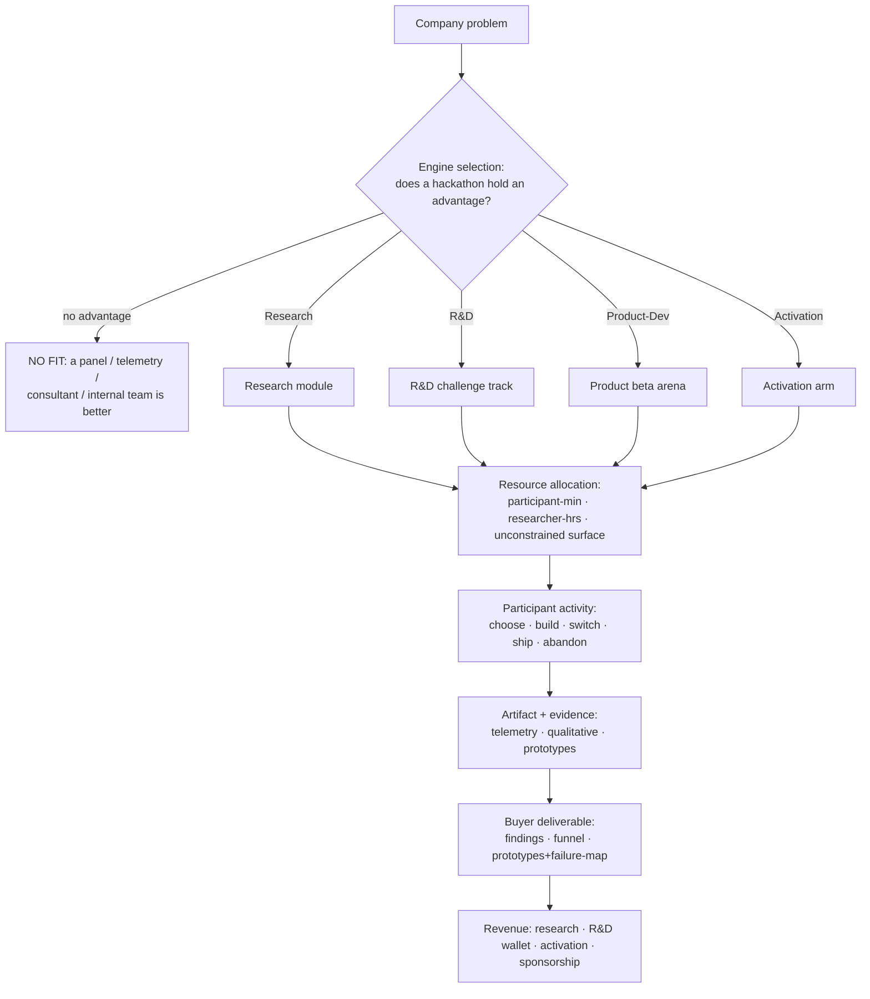
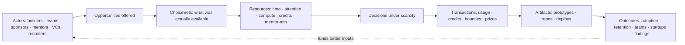
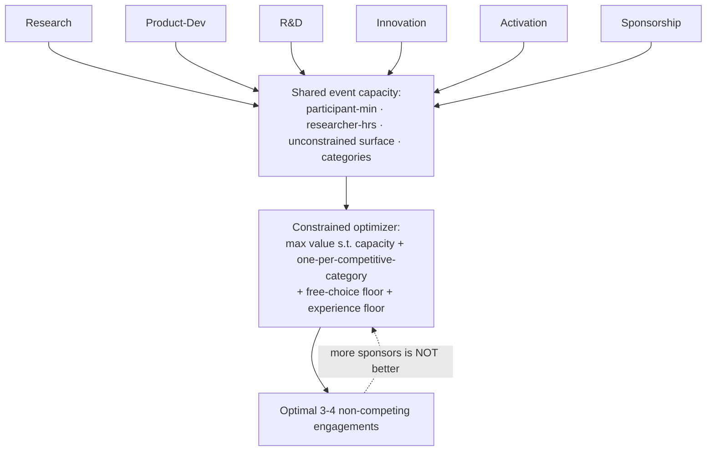
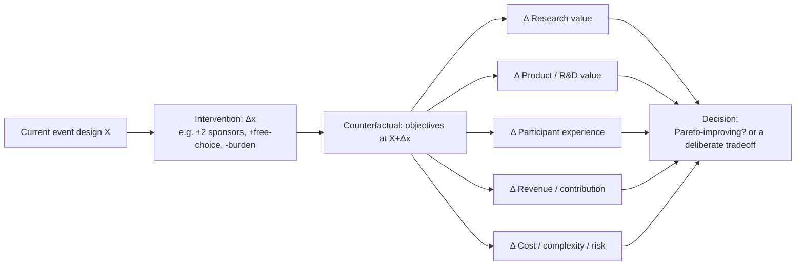
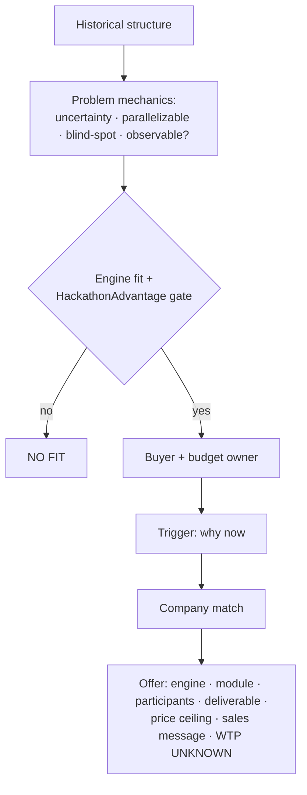

# Value Engine Flowcharts

The five diagrams from Part XXII. Mermaid renders on GitHub natively.

## 1. Master hackathon value engine — company problem → revenue



## 2. Event economy — the compressed micro-economy



## 3. Engine portfolio → shared event capacity → optimal portfolio



## 4. Tweak engine — change one thing, see all deltas



## 5. ICP discovery — structure → company → offer



## The loop the whole system serves

```
research/R&D revenue → funds a better builder experience → attracts a better cohort
→ produces better/uniquer evidence → commands higher enterprise WTP → funds a better experience → ↺
```

Evidenced link: better experience → better cohort (**LIKELY**). Hypothesis link: better research →
higher WTP (**the `wtp_research_elasticity` assumption** — the single most important thing to validate,
UNKNOWN until a pilot renews at a higher price).
